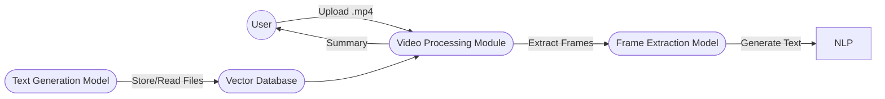
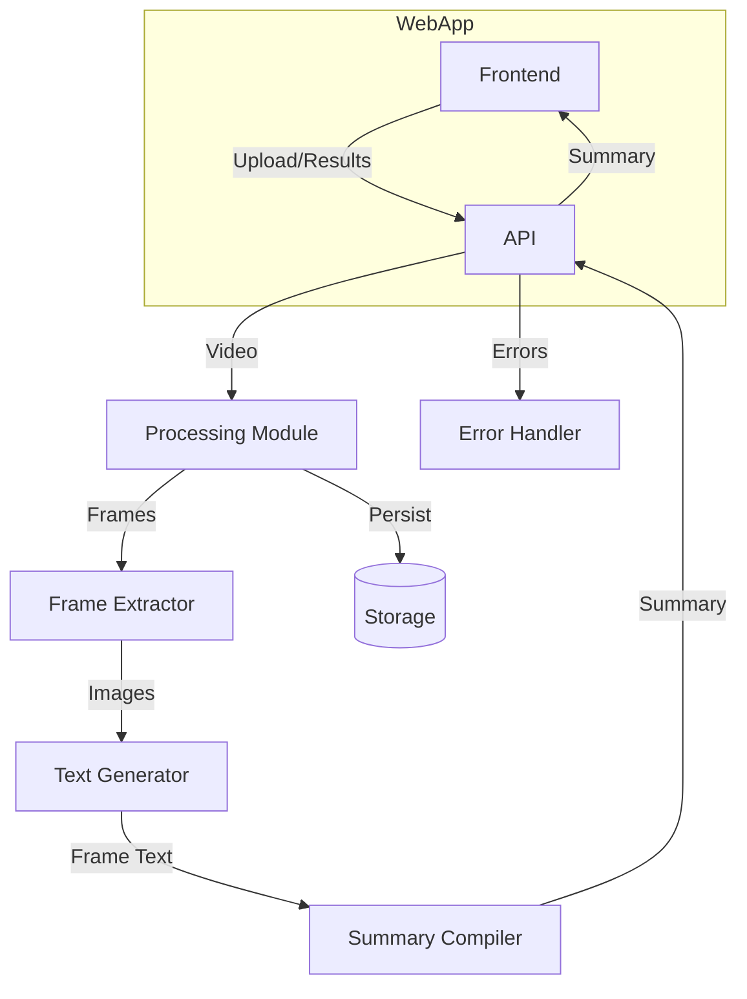
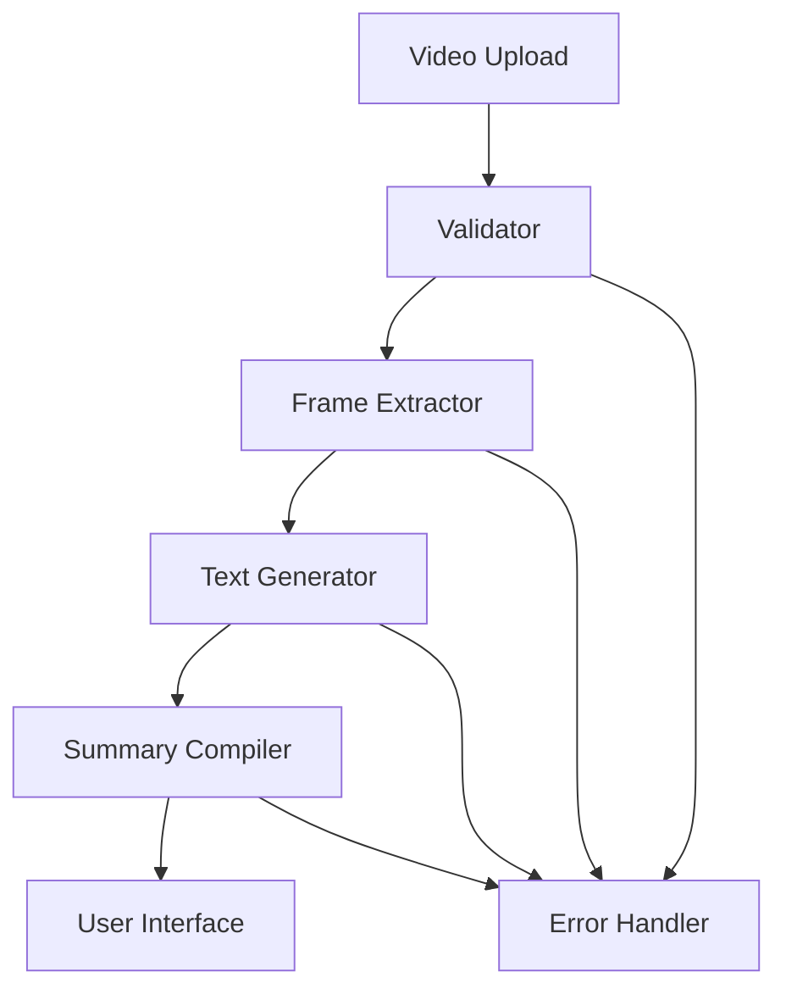
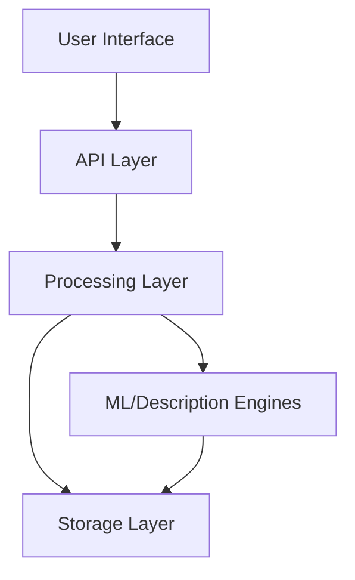
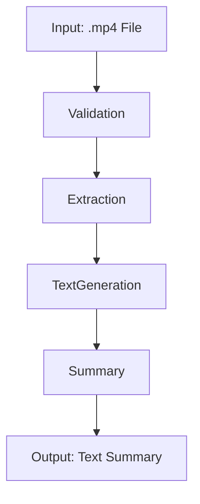

# Architecture Documentation

## Document Information

- **Version:** 1.1
- **Last Updated:** 2025-11-02
- **Author:** System Architect
- **Status:** Draft

## Executive Summary

This document outlines the architectural design for a video surveillance analysis system that converts video files into text descriptions. The system employs a modular architecture focusing on video processing and text generation, designed to meet performance and reliability requirements while maintaining scalability.

## System Overview

### Purpose
The system automates the conversion of surveillance video files into text descriptions. By processing video files frame by frame and generating human-readable summaries that describe what is happening in the video. 

### Key Requirements
- **Functional:**
  - Video file validation and processing (.mp4 format)
  - Frame extraction and analysis
  - Description generation
  - Summary compilation and management
  - Comprehensive error handling and logging

- **Non-Functional:**
  - Performance: Processing time < 5 minutes per video
  - Scalability: Support for 10+ concurrent users
  - Reliability: Error rate < 1%
  - Response Time: API responses < 500ms for 95th percentile

### Constraints
- **Technical Constraints:**
  - Must support .mp4 video files only
  - Maximum file size of 30MB
  - Must use open-source technologies
  - Must use pre-trained models for detection

- **Business Constraints:**
  - No support for live video streaming
  - Must complete processing within defined SLA
  - Limited to uploaded video files only

- **Regulatory Constraints:**
  - Must comply with GDPR and data protection regulations
  - Must maintain user data privacy and security

## Architecture Principles

1. **Simplicity First:** A simple architecture is faster to build, easier to maintain, and less prone to errors.
2. **GPU-First Design:** Ensures video frame analysis, detection, and summarization are fast and cost-efficient.
3. **Business Alignment:** Functionality directly mapped to user value (human-readable summaries)
4. **Early Validation & Fast Fail:** Saves GPU time and improves user feedback by rejecting invalid uploads instantly.
5. **Confidence-Driven Output:** Describe only what the model is sure of.

## High-Level Architecture

### System Context Diagram

### Container Diagram

## Detailed Architecture

### Component Diagram

### Layer Architecture

## Data Architecture

### Data Model

- **Summary:** (`video_id`, `summary`, `created_at`,`file_name`)

### Data Flow Diagram

## Integration Architecture

### Integration Patterns
- API integration (REST) for ML models and NLP
- Batch work queues for frame extraction

### API Architecture
- `/api/upload` — file upload
- `/api/status` — job status query
- `/api/summary/{id}` — summary retrieval

## Scalability & Performance

### Scaling Strategy
- API/processing horizontal scaling
- Batch queues for frame jobs
- Stateless, containerized services
### Caching Strategy
- Redis for job/data caches

## Monitoring & Observability
### Monitoring Architecture
- Logging, Prometheus metrics, error alerts
---

## Disaster Recovery

### Backup Strategy
- Daily backups, error log archive (7d)
### Failover Process
- Automated retries, alerting, failover nodes
---

## Technology Stack

### Frontend
- Framework: Flask / StreamLit
- Language: Python
- State: To be added
- UI: To be added
### Backend
- Runtime: Python
- Framework: FastAPI
- Language: Python

---

## Architecture Decision Records (ADRs)

### ADR-001: Store Data on File System
- **Date:** 2025-10-27
- **Status:** Accepted
- **Context:** Summaries, frame images, and videos could be stored in either a database or directly in the file system
- **Decision:** Store all user-uploaded videos, frame images, and generated summaries directly on a secure file system
- **Consequences:** Simplifies file management, works well for small-scale deployments; may need migration to cloud storage if scaling up
- **Alternatives:** Database or cloud object storage

### ADR-002: Single Video Processing at a Time
- **Date:** 2025-10-27
- **Status:** Accepted
- **Context:** Supporting parallel video processing would add technical complexity and consume more server resources
- **Decision:** Only one video per user will be processed at any given time in the MVP release
- **Consequences:** Easier server management and error handling; users may experience a wait if they submit multiple jobs
- **Alternatives:** Multiple simultaneous jobs per user (deferred to a future phase)

### ADR-003: No User Authentication
- **Date:** 2025-10-27
- **Status:** Accepted
- **Context:** Application is for internal/testing use only, not public release
- **Decision:** User authentication is not implemented
- **Consequences:**  Enables faster development and testing; must be addressed before any public launch for security reasons
- **Alternatives:** Implement authentication (to be considered for future releases)

## Quality Attributes
### Performance
- Response: ≤500ms (95th pct)
- Process: ≤5min/video
### Scalability
- Users: 10+
- Data: up to 100MB/video
- Growth: scalable by container
### Availability
- Uptime: ≥99.9%
- RTO: ≤1hr
- RPO: ≤24hr
### Security
- Compliance: GDPR
- Auth: JWT
- Encryption: TLS 1.3, AES-256
---
## Future Considerations
### Planned Improvements
- Multi-format support
- Parallel frame analysis
### Technical Debt
- Manual model switching
- Summary NLP can improve
### Scalability Roadmap
- Phase 1: 10 users/30MB video
- Phase 2: 100 users/GB-scale
- Phase 3: Near real-time insights
---
## References
- Requirements.md, Processes.md
- C4 Model
- ML/NLP documentation
---
## Glossary
| Term  | Definition |
|-------|------------|
| API   | Application Programming Interface |
| JWT   | JSON Web Token |
| FPS   | Frames Per Second |
---
## Approval
| Role            | Name             | Date       | Signature |
|-----------------|------------------|------------|-----------|
| Architect       | System Architect | 2025-10-27 |           |
| Technical Lead  |                  |            |           |
| Security Lead   |                  |            |           |
---
## Version History
| Version | Date       | Author          | Changes         |
|---------|------------|-----------------|-----------------|
| 1.1     | 2025-11-02 | System Architect| Removed the object/activity detection, added the decisions for Technical Stack  |
| 1.0     | 2025-10-27 | System Architect| Initial version |
---
