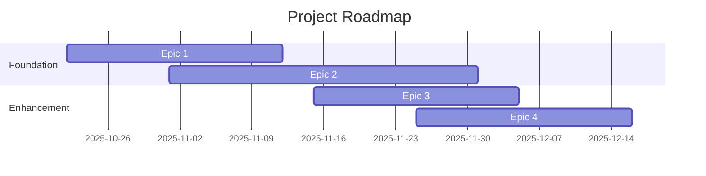
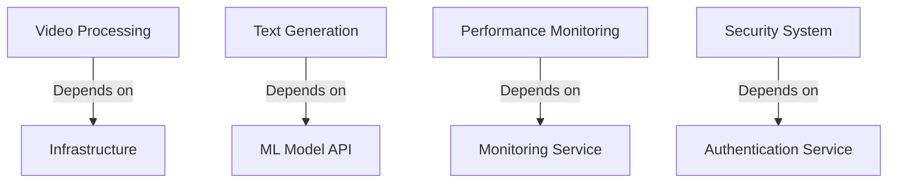

# Project Planning

## Document Information

- **Version:** 1.0
- **Last Updated:** 02/11/2025
- **Author:** Scrum Master/ Project Manager
- **Planning Horizon:** Two Months

## Project Overview

### Vision
To create an efficient and reliable video surveillance analysis system that automates the conversion of video content into meaningful text descriptions, enabling better understanding and analysis of surveillance footage.

### Goals & Objectives

1. **Goal 1:** Build a Robust Video Processing Pipeline
   - Objective 1.1: Implement video validation and frame extraction with 99.9% reliability
   - Objective 1.2: Achieve processing time under 5 minutes per video
   - Objective 1.3: Support concurrent processing of up to 10 users

2. **Goal 2:** Deliver High-Quality Text Summaries
   - Objective 2.1: Generate grammatically correct and contextually accurate descriptions
   - Objective 2.2: Achieve a confidence score of ≥75% for generated descriptions
   - Objective 2.3: Maintain API response times under 500ms for 95th percentile

## Roadmap

### Timeline Overview



### Milestones

| Milestone | Target Date | Status | Dependencies |
|-----------|-------------|--------|--------------|
| MVP Launch | 2025-11-18 | Planned | Epic 1, Epic 2 initial features |
| Beta Release | 2025-12-02 | Planned | Epic 3 core features |
| Production Release | 2025-12-15 | Planned | All Epics completed |

## Epics & Features

### Epic 1: Video Processing Pipeline

**Priority:** Critical  
**Status:** In Review  
**Owner:** Development Team  
**Target Quarter:** Q4 2025

#### Description
Implement the core video processing pipeline that handles video validation, frame extraction, and initial processing setup.

#### Business Value
Establishes the foundation for reliable video processing, ensuring only valid videos are processed and resources are used efficiently.

#### Success Criteria
- [ ] Successfully validate and process .mp4 files up to 30MB
- [ ] Extract frames at 1 frame per second with 99.9% reliability
- [ ] Process videos within 5 minutes
- [ ] Handle 10+ concurrent users

#### Features

##### Feature 1.1: Video Validation Service

**Story Points:** 5  
**Status:** To Do  
**Assignee:** TBD

###### User Story
```
As a developer
I want to implement robust video validation
So that only supported video files are processed
```

###### Acceptance Criteria
- [ ] Given an .mp4 file under 30MB, when uploaded, then validate and accept
- [ ] Given an unsupported file, when uploaded, then reject with clear error message
- [ ] Given multiple concurrent uploads, when processing, then handle without degradation

###### Technical Notes
- Uses Python for validation
- Requires file format and size checks
- Needs error logging integration

###### Definition of Ready
- [x] User story is clear and understandable
- [x] Acceptance criteria are defined
- [x] Dependencies are identified
- [x] Technical approach is understood
- [x] Story is estimated
- [ ] Designs are available (if needed)

###### Definition of Done
- [ ] Code complete and reviewed
- [ ] Unit tests written (>80% coverage)
- [ ] Integration tests passing
- [ ] Documentation updated
- [ ] Deployed to staging
- [ ] Acceptance criteria verified
- [ ] Product owner approval

###### Subtasks
- [ ] Implement file format validation
- [ ] Add size validation logic
- [ ] Create error handling system
- [ ] Write validation tests

---


### Epic 2: Text Generation System

**Priority:** High  
**Status:** In Review  
**Owner:** ML Team  
**Target Quarter:** Q4 2025

#### Description
Develop and implement the text generation system that converts video frames into meaningful descriptions and compiles them into coherent summaries.

#### Business Value
Enables automated understanding of video content, saving time and resources in surveillance analysis.

#### Success Criteria
- [ ] Generate accurate descriptions with ≥75% confidence score
- [ ] Maintain API response times under 500ms
- [ ] Create coherent summaries from frame descriptions
- [ ] Handle errors gracefully with proper logging

#### Features

##### Feature 2.1: Frame Description Generator

**Story Points:** 8  
**Status:** Backlog

###### User Story
```
As a developer
I want to implement frame-to-text generation
So that video frames can be accurately described in text
```

###### Acceptance Criteria
- [ ] Given a video frame, generate grammatically correct description
- [ ] Given multiple frames, maintain context between descriptions
- [ ] Given processing errors, log and handle gracefully

---

### Epic 3: System Performance & Scalability

**Priority:** High  
**Status:** In Review  
**Owner:** DevOps Team  
**Target Quarter:** Q4 2025

#### Description
Implement performance optimizations, monitoring, and scaling capabilities to ensure the system meets production-grade requirements.

#### Business Value
Ensures system reliability, maintainability, and ability to handle increased load while maintaining performance standards.

#### Success Criteria
- [ ] Achieve <5 minutes processing time for videos
- [ ] Support 10+ concurrent users
- [ ] Implement comprehensive monitoring and alerting
- [ ] Set up auto-scaling capabilities

#### Features

##### Feature 3.1: Performance Monitoring System

**Story Points:** 5  
**Status:** Backlog

###### User Story
```
As a system administrator
I want to implement comprehensive monitoring
So that I can track system performance and identify issues early
```

###### Acceptance Criteria
- [ ] Monitor CPU, memory, and GPU usage
- [ ] Track processing times and queue lengths
- [ ] Set up alerting for critical metrics
- [ ] Create performance dashboards

---

### Epic 4: Security & Compliance

**Priority:** Critical  
**Status:** In Progress  
**Owner:** Security Team  
**Target Quarter:** Q4 2025

#### Description
Implement security measures, access controls, and ensure compliance with data protection regulations.

#### Business Value
Protects user data, ensures regulatory compliance, and maintains system integrity.

#### Success Criteria
- [ ] Implement secure file handling
- [ ] Set up access control and authentication
- [ ] Ensure GDPR compliance
- [ ] Complete security audit

#### Features

##### Feature 4.1: Secure File Management

**Story Points:** 8  
**Status:** Backlog

###### User Story
```
As a security engineer
I want to implement secure file handling
So that user data is protected throughout the processing pipeline
```

###### Acceptance Criteria
- [ ] Implement encrypted file storage
- [ ] Set up secure file deletion
- [ ] Create audit logging system
- [ ] Implement access controls

---

## Sprint Planning

### Sprint 1: Foundation Setup

**Duration:** 2025-10-22 - 2025-11-04  
**Sprint Goal:** Set up basic video processing pipeline with validation  
**Capacity:** 34 story points

#### Committed Stories

| ID | Story | Points | Assignee | Status |
|----|-------|--------|----------|--------|
| US-001 | Set up video validation service | 5 | TBD | To Do |
| US-002 | Setup development environment | 3 | TBD | To Do |
| US-003 | Create error handling system | 5 | TBD | To Do |
| US-004 | Implement secure file storage | 8 | TBD | To Do |
| US-005 | Basic monitoring setup | 5 | TBD | To Do |
| US-006 | Set up basic UI for upload | 8 | TBD | To Do |

#### Sprint Risks
- New team members may need time to ramp up
- Integration points between services may be complex
- Security implementation might need additional review

#### Sprint Dependencies
- Development environment setup
- Access to GPU resources for processing
- Security requirements documentation

---

### Sprint 2: Core Processing

**Duration:** 2025-11-05 - 2025-11-18  
**Sprint Goal:** Implement frame extraction and initial text generation  
**Capacity:** 37 story points

#### Committed Stories

| ID | Story | Points | Assignee | Status |
|----|-------|--------|----------|--------|
| US-007 | Implement frame extraction | 8 | TBD | To Do |
| US-008 | Set up text generation pipeline | 13 | TBD | To Do |
| US-009 | Implement access controls | 8 | TBD | To Do |
| US-010 | Create performance monitoring dashboard | 5 | TBD | To Do |
| US-011 | Error recovery system | 3 | TBD | To Do |

---

### Sprint 3: Advanced Features

**Duration:** 2025-11-19 - 2025-12-02  
**Sprint Goal:** Enhance text generation and implement scaling  
**Capacity:** 34 story points

#### Committed Stories

| ID | Story | Points | Assignee | Status |
|----|-------|--------|----------|--------|
| US-012 | Optimize frame description generation | 8 | TBD | To Do |
| US-013 | Implement auto-scaling | 13 | TBD | To Do |
| US-014 | Advanced error handling | 5 | TBD | To Do |
| US-015 | Audit logging system | 8 | TBD | To Do |

---

### Sprint 4: Production Readiness

**Duration:** 2025-12-03 - 2025-12-15  
**Sprint Goal:** System hardening and performance optimization  
**Capacity:** 34 story points

#### Committed Stories

| ID | Story | Points | Assignee | Status |
|----|-------|--------|----------|--------|
| US-016 | Performance optimization | 13 | TBD | To Do |
| US-017 | Security hardening | 8 | TBD | To Do |
| US-018 | Documentation completion | 5 | TBD | To Do |
| US-019 | Final UI enhancements | 8 | TBD | To Do |

---

## Backlog

### Prioritized Backlog

| Priority | ID | Story | Points | Epic | Status |
|----------|-----|-------|--------|------|--------|
| 1 | US-001 | Video Validation Service | 5 | Video Processing | To Do |
| 2 | US-002 | Frame Extraction Implementation | 8 | Video Processing | To Do |
| 3 | US-003 | Error Handling System | 5 | Video Processing | To Do |
| 4 | US-004 | Basic Upload UI | 3 | Video Processing | To Do |
| 5 | US-005 | Frame Description Generator | 8 | Text Generation | To Do |
| 6 | US-006 | Summary Compilation Service | 5 | Text Generation | To Do |

### Backlog Refinement

**Next Session:** 2026-01-07  
**Participants:** Development Team, Product Owner, Scrum Master

#### Stories to Refine
- [ ] US-007: Performance Optimization for Frame Processing
- [ ] US-008: Advanced Error Recovery System
- [ ] US-009: User Interface Enhancements


## Technical Stories

### Technical Debt

| ID | Description | Priority | Estimated Effort | Status |
|----|-------------|----------|-----------------|--------|
| TD-001 | Implement automated testing pipeline | High | 5 days | Planned |
| TD-002 | Set up continuous deployment workflow | High | 4 days | Planned |
| TD-003 | Implement caching for processed frames | Medium | 3 days | Planned |
| TD-004 | Optimize database schema for scaling | Medium | 3 days | Planned |


### Infrastructure Stories

| ID | Description | Priority | Estimated Effort | Status |
|----|-------------|----------|-----------------|--------|
|
| IS-001 | Implement auto-scaling configuration | High | 4 days | To Do |
| IS-002 | Set up monitoring and alerting infrastructure | High | 3 days | To Do |
| IS-003 | Configure backup and disaster recovery | High | 3 days | To Do |
| IS-004 | Implement secure storage for video files | Critical | 4 days | To Do |

## Dependencies

### External Dependencies



### Internal Dependencies

| Feature | Depends On | Impact if Delayed |
|---------|------------|-------------------|
| Frame Extraction | Video Validation | Cannot process invalid videos |
| Text Generation | Frame Extraction | No input for description generation |
| Summary Compilation | Text Generation | No content for summary creation |
| Performance Monitoring | All Core Services | Limited visibility into system health |
| Auto-scaling | Monitoring Service | Cannot adjust to load changes |
| Security Audit | Access Control System | Compliance requirements not met |

## Resource Planning

### Team Allocation

| Team Member | Role | Capacity (hrs/week) | Current Allocation | Available |
|-------------|------|----------|-------------------|-----------|
| Lead Developer | Technical Lead | 40 | Video Processing (50%), Architecture (50%) | 0% |
| ML Engineer | ML Specialist | 40 | Text Generation (70%), Model Training (30%) | 0% |
| Backend Dev 1 | Backend Developer | 40 | Video Processing (70%), API Development (30%) | 0% |
| Backend Dev 2 | Backend Developer | 40 | Security (60%), Infrastructure (40%) | 0% |
| DevOps Engineer | DevOps Specialist | 40 | Infrastructure (50%), Monitoring (50%) | 0% |
| QA Engineer | Quality Assurance | 40 | Testing (70%), Documentation (30%) | 0% |

### Skills Matrix

| Team Member | Python/ML | DevOps/Cloud | Security | Video Processing |
|-------------|---------|---------|---------|---------|
| Lead Developer | ★★★★★ | ★★★☆☆ | ★★★☆☆ | ★★★★☆ |
| ML Engineer | ★★★★★ | ★★☆☆☆ | ★★☆☆☆ | ★★★☆☆ |
| Backend Dev 1 | ★★★★☆ | ★★★☆☆ | ★★★☆☆ | ★★★★☆ |
| Backend Dev 2 | ★★★★☆ | ★★★☆☆ | ★★★★☆ | ★★★☆☆ |
| DevOps Engineer | ★★★☆☆ | ★★★★★ | ★★★★☆ | ★★☆☆☆ |
| QA Engineer | ★★★★☆ | ★★★☆☆ | ★★★☆☆ | ★★★☆☆ |

## Risk Management

### Planning Risks

| Risk | Probability | Impact | Mitigation | Owner |
|------|-------------|--------|------------|-------|
| Performance bottlenecks in video processing | High | High | Early performance testing, GPU optimization, implement caching | Tech Lead |
| ML model accuracy issues | High | High | Extensive testing with varied video content, model fine-tuning | ML Engineer |
| Resource constraints for GPU processing | Medium | High | Cloud resource planning, implement queue system, auto-scaling | DevOps Engineer |
| Integration complexity between services | Medium | High | Proper API design, thorough integration testing, clear documentation | Backend Dev 1 |
| Security vulnerabilities in file handling | Medium | Critical | Regular security audits, secure file handling implementation | Backend Dev 2 |
| Scaling issues with concurrent users | Medium | High | Load testing, performance monitoring, optimization | DevOps Engineer |
| Data protection compliance (GDPR) | Medium | Critical | Implementation review, security audit, documentation | Lead Developer |
| System reliability under load | High | High | Comprehensive testing, monitoring, fallback mechanisms | QA Engineer |
| Timeline constraints | High | Medium | Agile methodology, regular progress tracking, risk-based prioritization | Tech Lead |
| Knowledge gaps in team | Medium | Medium | Training sessions, documentation, pair programming | Lead Developer |

## Definition of Ready (DoR)

### Story DoR Checklist
- [ ] User story follows standard format
- [ ] Acceptance criteria are clear and testable
- [ ] Dependencies identified and documented
- [ ] Technical feasibility assessed
- [ ] Story is sized/estimated
- [ ] Business value is clear
- [ ] UI/UX designs available (if applicable)

### Epic DoR Checklist
- [ ] Business value and objectives defined
- [ ] Success criteria established
- [ ] High-level scope defined
- [ ] Dependencies identified
- [ ] Rough timeline estimated
- [ ] Stakeholders identified

## Definition of Done (DoD)

### Story DoD Checklist
- [ ] Code implemented and follows coding standards
- [ ] Code reviewed and approved
- [ ] Unit tests written (>80% coverage)
- [ ] Integration tests passing
- [ ] Documentation updated
- [ ] Security review completed (if applicable)
- [ ] Performance requirements met
- [ ] Accessibility standards met
- [ ] Deployed to staging environment
- [ ] Acceptance criteria verified
- [ ] Product owner sign-off

### Epic DoD Checklist
- [ ] All features completed
- [ ] End-to-end testing completed
- [ ] User acceptance testing passed
- [ ] Production deployment completed
- [ ] Monitoring and alerting configured
- [ ] Documentation finalized
- [ ] Training completed (if applicable)
- [ ] Success metrics baseline established

## Estimation Guidelines

### Story Points Reference

| Points | Complexity | Effort | Risk |
|--------|-----------|--------|------|
| 1 | Very Simple | < 2 hours | None |
| 2 | Simple | 2-4 hours | Low |
| 3 | Medium | 1 day | Low |
| 5 | Complex | 2-3 days | Medium |
| 8 | Very Complex | 4-5 days | High |
| 13 | Epic | 1-2 weeks | High |


## Metrics & Tracking

### Velocity Tracking

| Sprint | Committed | Completed | Velocity | Team Changes |
|--------|-----------|-----------|----------|--------------|
| Sprint 1 | 40 | - | - | Project Initiation |
| Sprint 2 | - | - | - | - |

### Burndown

To be tracked in Jira/Azure DevOps with daily updates

### Key Metrics

| Metric | Current | Target | Trend |
|--------|---------|--------|-------|
| Sprint Velocity | - | 40 pts | - |
| Processing Time | - | <5 min | - |
| API Response Time | - | <500ms | - |
| Description Accuracy | - | ≥75% | - |
| Defect Rate | - | <1% | - |

## Communication Plan

### Ceremonies

| Ceremony | Frequency | Duration | Participants | Purpose |
|----------|-----------|----------|--------------|---------|
| Sprint Planning | Every 2 weeks | 2 hours | Dev Team, PO, SM | Plan sprint |
| Daily Standup | Daily | 15 min | Dev Team | Sync progress |
| Sprint Review | Every 2 weeks | 1 hour | Team, Stakeholders | Demo work |
| Sprint Retro | Every 2 weeks | 1 hour | Dev Team | Improve process |
| Backlog Refinement | Weekly | 1 hour | Dev Team, PO | Refine stories |

### Status Reporting

- **Weekly Status:** [Monday, 8.45-9.15]
- **Monthly Review:** [Last Friday of the month,10.00-11.00  ]
- **Stakeholder Updates:** [First Monday of month]

## Version History

| Version | Date | Author | Changes |
|---------|------|--------|---------|
| 1.0 | | | Initial version |

